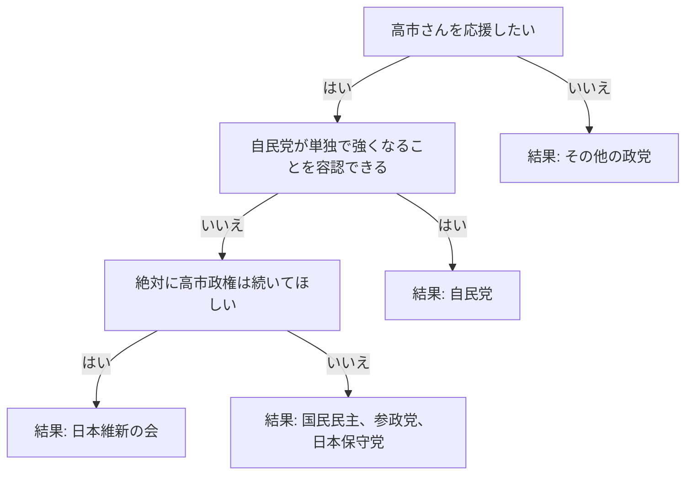

# フローチャートの定義

ここにフローチャートの構成を記述してください。
テキストベースですが、構造が直感的にわかります。

## 形式1：図で書く (Mermaid形式)
VS Codeなどのエディタでプレビューすると図として表示されます。

## 形式2：リストで書く (箇条書き)
もし上の図が書きにくければ、以下のように箇条書きで書いていただくだけでも大丈夫です！

- **質問1**: 統一教会の信者である(もしくは関連団体)
    - **はい** -> 結果：自民党
    - **いいえ** -> 質問2へ
- **質問2**: 別に政治家はお金に汚くだらしなくても問題ない
    - **はい** -> 結果：自民党
    - **いいえ** -> 質問3へ
- **質問3**: 大阪の副首都構想が一番大事な政策である
    - **はい** -> 結果：日本維新の会
    - **いいえ** -> 質問4へ
- **質問4**: 具体性と実現性を大事にして手取りを増やすことが一番大事だ
    - **はい** -> 結果：国民民主党
    - **いいえ** -> 質問5へ
- **質問5**: 外国人政策が一番大事だ
    - **はい** -> 質問6へ
    - **いいえ** -> 質問7へ
- **質問6**: 移民は1人もいらない
    - **はい** -> 結果：日本保守党
    - **いいえ** -> 結果：参政党
- **質問7**: 創価学会の信者である
    - **はい** -> 結果：中道改革連合
    - **いいえ** -> 質問8へ
- **質問8**: 夫婦別姓の導入や、徹底した平和主義・護憲が大事だ
    - **はい** -> 結果：中道改革連合
    - **いいえ** -> 質問9へ
- **質問9**: 消費税を将来的にでも0％にしてほしい
    - **はい** -> 質問10へ
    - **いいえ** -> 質問11へ
- **質問10**: 今すぐ消費税は0％にするべきだ
    - **はい** -> 結果：れいわ新選組
    - **いいえ** -> 質問11へ
- **質問11**: 政治にデジタル技術をフル活用し、効率的な社会を実現することが一番大事だ
    - **はい** -> 結果：チームみらい
    - **いいえ** -> 質問12へ
- **質問12**: 私の生活は幸せです
    - **はい** -> 結果：与党のどれかから選ぼう。どれを選んでも今と変わらない生活を保つために努力します。
    - **いいえ** -> 結果：野党のどれかから選ぼう。どれを選んでもあなたが幸せになるように現状を変える努力する政党です。

---
どちらの書き方でも、私が内容を読み取ってアプリを作成します。
このファイルを編集していただくか、チャット欄に直接貼り付けていただいても大丈夫です！
