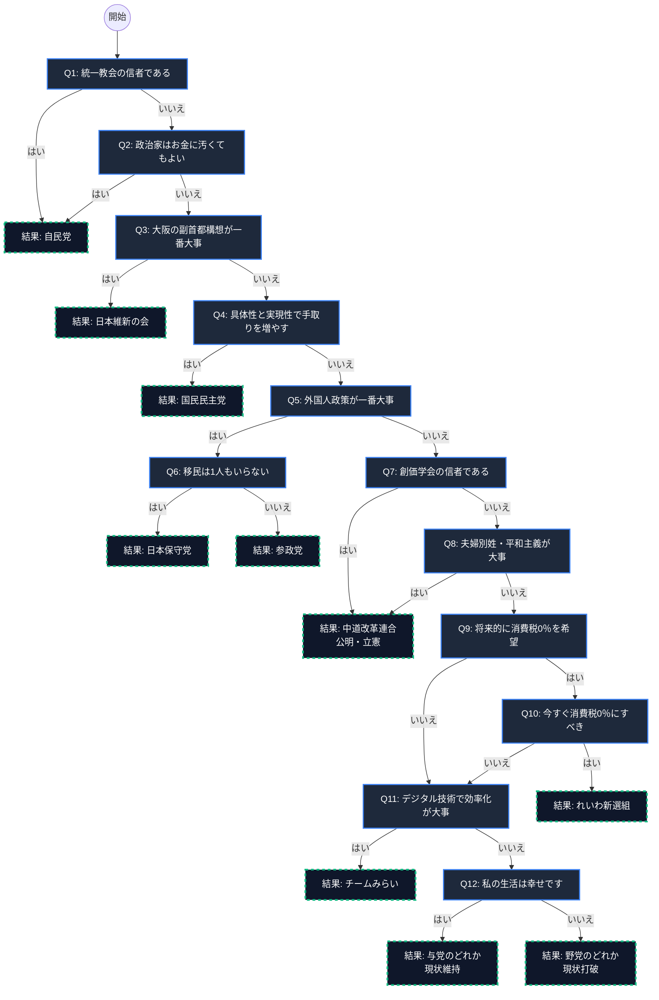

# 政治志向診断 フローチャート全体図

以下のコードをコピーして [Mermaid Live Editor](https://mermaid.live/) に貼り付けるか、VS Code の Mermaid プレビュー機能を使用することで、画像として書き出すことができます。

---

### 画像として保存する方法
1. 上記の `mermaid` ブロック内のコードをコピーします。
2. [Mermaid Live Editor](https://mermaid.live/) を開きます。
3. 左側の入力欄（Code）を全消しして、コピーした内容を貼り付けます。
4. 下の方にある **「Actions」** -> **「Download PNG」** または **「Download SVG」** を選ぶと、綺麗な画像として保存できます。
